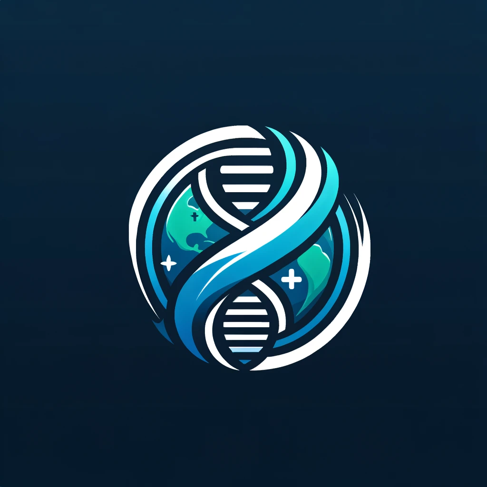

[](https://classroom.github.com/a/j48a217e)




# GlobeMediWatch

## A Community-Driven Platform for Health Camps and Wellness Activities

GlobeMediWatch is a health-focused community platform dedicated to organizing medical health camps that serve the public by offering basic health care services. With a commitment to health and wellness, our app facilitates a range of activities including blood donation drives and vital checks such as blood pressure and blood sugar monitoring.

## Problem Being Solved

In many communities, access to basic health care services can be limited. GlobeMediWatch addresses this gap by organizing health camps that provide essential health care services to those who need them the most, effectively bringing the clinic to the community.

### Target Users

- **General Users**: Individuals looking to contribute to their community can use GlobeMediWatch to find volunteer opportunities, participate in health camps, and make donations.
- **Health Organizations**: Professional bodies can collaborate with us to organize health camps, initiate fundraisers, and contribute their expertise to the welfare of the community.
- **Volunteers**: The backbone of our operations, volunteers can sign up for various tasks and responsibilities, making a tangible difference in the community.

### Key Features

- **Donations/Fundraiser**: A secure and transparent platform for initiating and contributing to fundraisers that support various health camps and services.
- **Camp Management**: Organizers can set up and manage camps, detailing the services offered, schedules, and necessary resources.
- **Location Services**: Allows users to find camps based on their location, making it easy to access nearby health services.
- **Notifications and Alerts**: Keeps the community informed about upcoming health camps, services offered, and any updates or changes to scheduled events.
- **Services**: An outline of all the services provided at the health camps, ensuring users know what to expect and can prepare accordingly.

### CRUD Operations

Our platform is designed to be interactive and user-friendly, ensuring that all participants can engage with the system efficiently through the following CRUD operations:

- **Create**:
  - Users can register accounts to join the GlobeMediWatch community as a volunteer, donor, or health organization.
  - Health organizations can create campaigns for health camps, set up fundraising events, and post health advisories.
  - Volunteers can sign up for upcoming events and help based on their expertise.

- **Read**:
  - Access real-time updates on health camps, upcoming events, and fundraisers.
  - View detailed information on camp locations, schedules, and available services.

- **Update**:
  - Users can update their profiles, preferences, and their participation in various activities.
  - Health organizations have the ability to update details of health camps and fundraisers to reflect the latest information.

- **Delete**:
  - Users have the autonomy to delete their accounts if they choose to leave the platform.
  - Volunteers can cancel their registration
  - Delete a service in a camp if it is not required.

By integrating these fundamental CRUD operations into GlobeMediWatch, we offer a comprehensive toolkit for managing and participating in community health initiatives.

### Object Model

```mermaid
classDiagram
   class User {
      +userID: int
      +name: string
      +email: string
      +password: string
      +role: enum
      +login(): void
      +logout(): void
      +updateProfile(): void
   }
   class HealthOrganization {
      +organizationID: int
      +organizationName: string
      +servicesProvided: Service[]
      +campsHosted: Camp[]
      +createCamp(): void
      +updateCamp(): void
      +deleteCamp(): void
   }
   class Volunteer {
      +volunteerID: int
      +expertiseArea: string
      +availability: string
      +campsVolunteered: Camp[]
      +volunteerForCamp(): void
      +leaveCamp(): void
   }
   class DonationFundraiser {
      +fundraiserID: int
      +title: string
      +description: string
      +goalAmount: float
      +currentAmount: float
      +associatedCampID: int
      +donors: User[]
      +donate(): void
      +updateFundraiserDetails(): void
   }
   class Camp {
      +campID: int
      +campName: string
      +date: datetime
      +patients: Patient[]
      +organizers: HealthOrganization[]
      +volunteers: Volunteer[]
      +addPatient(): void
      +addVolunteer(): void
      +removePatient(): void
      +removeVolunteer(): void
   }
   class Location {
      +locationID: int
      +address: string
      +city: string
      +state: string
      +country: string
      +zipCode: string
      +updateLocationDetails(): void
   }
   class Notification {
      +notificationID: int
      +targetUser: User
      +message: string
      +timeStamp: datetime
      +sendNotification(): void
   }
   class Services {
      +serviceID: int
      +serviceName: string
      +description: string
      +offeredBy: HealthOrganization
      +updateServiceDetails(): void
   }
   class Patient {
      +patientID: int
      +medicalHistory: string
      +currentConditions: string
      +campsAttended: Camp[]
      +updateMedicalHistory(): void
      +updateCurrentConditions(): void
   }
   class PatientRecord {
      +recordID: int
      +patientID: int
      +campID: int
      +serviceDetails: string[]
      +diagnosis: string
      +treatmentProvided: string
      +followUpInstructions: string
      +createRecord(): void
      +updateRecord(): void
      +addServiceDetail(): void
   }
   User <|-- HealthOrganization
   User <|-- Volunteer
   User <|-- Patient
   Camp "1" *-- "1" Location
   Camp "1..n" *-- "0..n" Services
   Camp "1..n" o-- "1..n" HealthOrganization
   Camp "1..n" o-- "0..n" Volunteer
   Camp "1..n" o-- "0..n" Patient
   PatientRecord "1..n" --> "1" Patient
   PatientRecord "1..n" --> "1" Camp
   HealthOrganization "1..n" --> "0..n" Services
   DonationFundraiser "1..n" --> "0..n" User
   DonationFundraiser "1" o-- "1..n" Camp
   Notification "1..n" --> "1" User
   ``` 
## REST API Endpoints

The following endpoints are available for interacting with the GlobeMediWatch platform:

### Users
- `POST /users` - Create a new user
- `GET /users/{userID}` - Retrieve a specific user
- `GET /users` - Retrieve all users
- `PUT /users/{userID}` - Update a specific user
- `DELETE /users/{userID}` - Delete a specific user

### Health Organizations
- `POST /healthOrganizations` - Create a new health organization
- `GET /healthOrganizations/{organizationID}` - Retrieve a specific health organization
- `GET /healthOrganizations` - Retrieve all health organizations
- `PUT /healthOrganizations/{organizationID}` - Update a specific health organization
- `DELETE /healthOrganizations/{organizationID}` - Delete a specific health organization
- `POST /healthOrganizations/{organizationID}/camps` - Create a camp under a specific health organization

### Volunteers
- `POST /volunteers` - Create a new volunteer
- `GET /volunteers/{volunteerID}` - Retrieve a specific volunteer
- `GET /volunteers` - Retrieve all volunteers
- `PUT /volunteers/{volunteerID}` - Update a specific volunteer
- `DELETE /volunteers/{volunteerID}` - Delete a specific volunteer
- `POST /camps/{campID}/volunteers/{volunteerID}` - Volunteer for a camp
- `DELETE /camps/{campID}/volunteers/{volunteerID}` - Leave a camp

### Camps
- `POST /camps` - Create a new camp
- `GET /camps/{campID}` - Retrieve a specific camp
- `GET /camps` - Retrieve all camps
- `PUT /camps/{campID}` - Update a specific camp
- `DELETE /camps/{campID}` - Delete a specific camp

### Donation Fundraisers
- `POST /donationFundraisers` - Create a new fundraiser
- `GET /donationFundraisers/{fundraiserID}` - Retrieve a specific fundraiser
- `GET /donationFundraisers` - Retrieve all fundraisers
- `PUT /donationFundraisers/{fundraiserID}` - Update a specific fundraiser
- `DELETE /donationFundraisers/{fundraiserID}` - Delete a specific fundraiser
- `POST /donationFundraisers/{fundraiserID}/donate` - Donate to a fundraiser

### Patients
- `POST /patients` - Create a new patient
- `GET /patients/{patientID}` - Retrieve a specific patient
- `GET /patients` - Retrieve all patients
- `PUT /patients/{patientID}` - Update a specific patient
- `DELETE /patients/{patientID}` - Delete a specific patient

### Patient Records
- `POST /patientRecords` - Create a new patient record
- `GET /patientRecords/{recordID}` - Retrieve a specific patient record
- `GET /patientRecords` - Retrieve all patient records
- `PUT /patientRecords/{recordID}` - Update a specific patient record
- `DELETE /patientRecords/{recordID}` - Delete a specific patient record

### Notifications
- `POST /notifications` - Send a new notification
- `GET /notifications/{notificationID}` - Retrieve a specific notification
- `GET /notifications` - Retrieve all notifications

### Services
- `POST /services` - Create a new service
- `GET /services/{serviceID}` - Retrieve a specific service
- `GET /services` - Retrieve all services
- `PUT /services/{serviceID}` - Update a specific service
- `DELETE /services/{serviceID}` - Delete a specific service


### Our Team

- Sri Charan Balakundhi - [balakundhi.s@northeastern.edu](mailto:balakundhi.s@northeastern.edu)
- Saurabh Srivastava - [srivastava.sau@northeastern.edu](mailto:srivastava.sau@northeastern.edu)
- Neeraj Saini - [saini.ne@northeastern.edu](mailto:saini.ne@northeastern.edu)
- Srijith Makam - [makam.s@northeastern.edu](mailto:makam.s@northeastern.edu)


# Project Milestones and User Stories

Our project is organized into specific milestones, each with a set of user stories that guide our development efforts. Below is the breakdown of these milestones and the respective user stories that our team will be addressing throughout the project lifecycle.

## Milestone 1: Project Setup and Basic User Management

**User Stories**

- As an administrator, I want to set up the initial project structure, so that the development team has a clear understanding of the project architecture.
- As a user, I want to register an account, so that I can log in and access personalized features.
- As a user, I want to log in to my account, so that I can access the system's features.
- As a user, I want to update my profile, so that my personal information is current.

## Milestone 2: Health Organization Management

**User Stories**

- As a health organization, I want to create a profile, so that I can organize health camps.
- As a health organization, I want to list services provided at camps, so that patients know what services are available.

## Milestone 3: Volunteer Management

**User Stories**

- As a volunteer, I want to view a list of available health camps, so that I can find opportunities where my help is needed.
- As a volunteer, I want to select and sign up for volunteering opportunities at specific health camps, so that I can contribute my skills and time where it's most needed.
- As a volunteer, I want to withdraw from a volunteering opportunity before the event, in case my availability changes.

## Milestone 4: Donation and Fundraiser Management

**User Stories**

- As a user, I want to view active fundraisers, so that I can choose where to donate.
- As a user, I want to make donations to a fundraiser, so that I can support health camps financially.
- As a health organization, I want to create and manage fundraisers, so that we can fund health camps.

## Milestone 5: Camp and Services Management

**User Stories**

- As a health organization, I want to schedule camps, including time and location, so that volunteers and patients can plan to attend.
- As a user, I want to view upcoming health camps, so that I can attend or volunteer.
- As a health organization, I want to manage services offered at each camp, so that patients can receive the necessary healthcare.

## Milestone 6: Patient Management and Record Keeping

**User Stories**

- As a health organization, I want to create and manage patient records, so that we can keep track of treatments and health services provided.

## Milestone 7: Notifications and Alerts

**User Stories**

- As a user, I want to receive notifications about health camps, so that I stay informed about upcoming events.
- As a health organization, I want to send out alerts and updates about health camps, so that registered users are informed of any changes.

## Milestone 8: Reporting and Analytics

**User Stories**

- As a health organization, I want to access reports on camp attendance and service usage, so that we can measure the impact of our camps.
- As an administrator, I want to view analytics on donations and volunteer participation, so that we can improve our outreach and support.


